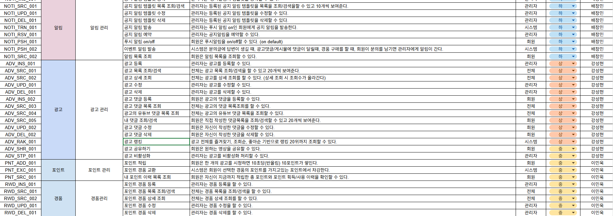
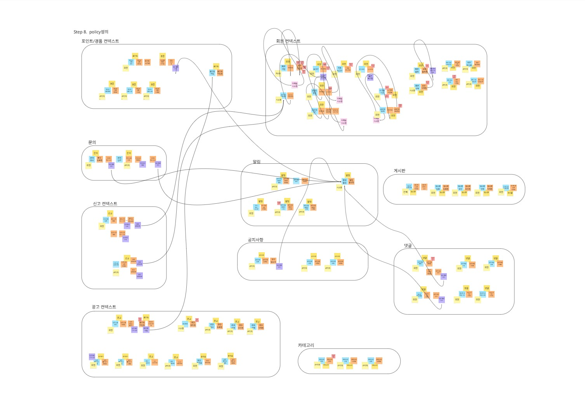
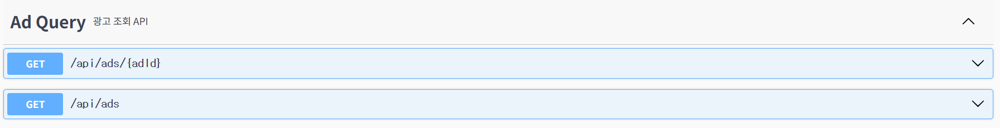
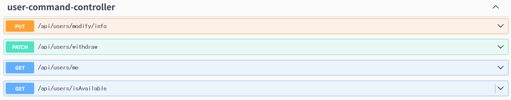
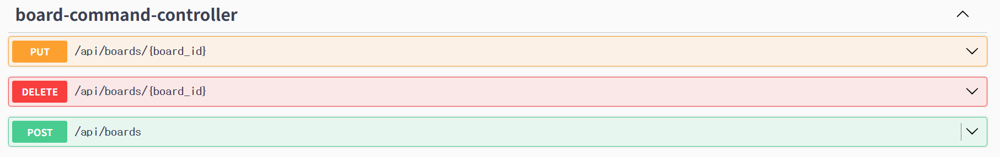
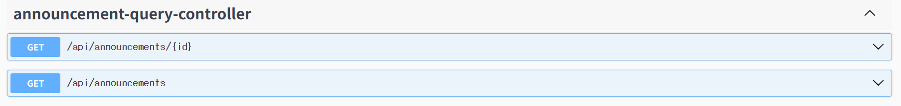
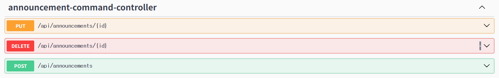
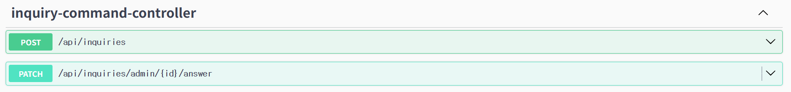
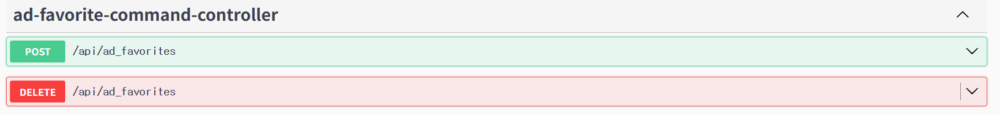

<div align="center">

# 📺**ADHD:광고당했대**
### "광고를 본다는 건 더 이상 시간 낭비가 아니다."

</div>
<br>


## 🔍 목차
[👤팀원소개](#-팀원-소개) <br>
[🛠️ 기술 스택](#-기술-스택) <br>
[📑 프로젝트 기획](#-프로젝트-기획) <br>
[🔗 문서 링크](#-문서-링크) <br>
[🧪테스트 보고서](#-테스트-보고서) <br>
[📢 트러블슈팅](#-트러블슈팅) <br>
[ 👨‍👩‍👧‍👦 팀원 회고](#-팀원-회고) <br>

<br>

## 👤 **팀원 소개**

<table style="width: 100%; text-align: center;">
<tr>
<td align="center"> <a href="https://github.com/zkvn99">이민욱</a></td>
<td align="center"> <a href="https://github.com/kim100000000">김성태</a></td>
<td align="center"> <a href="https://github.com/ChAnGMiNBae">배창민</a></td>
<td align="center"> <a href="https://github.com/okok02110211">강성현</a></td>
<td align="center"> <a href="https://github.com/Hyennnn">정혜인</a></td>
</tr>
<tr>
<td align="center">
    
</td>
<td align="center">
    
</td>
<td align="center">
    
</td>
<td align="center">
    
</td>
<td align="center">
    
</td>
</tr>
</table>

<br>

## 🛠️ **기술 스택**

#### 📂Database
  


#### 🚀Backend
 

#### 🛠️Tools
   
 

#### 💬Communication
  

<br>

## 📑 **프로젝트 기획**

### 프로젝트 소개 

> 프로젝트 개요

ADHD: 광고당했다 (AD HELL)은 기업에서 제공한 광고 영상만을 모아 사용자가 시청하고 보상을 얻는 광고 전용 플랫폼입니다.

> 기획 배경

기존 광고는 사용자의 관심 부족과 피로감으로 인해 효율이 떨어지고 광고 시청과 참여를 보상과 연결하여 사용자 동기 부여 필요하다고 생각했고 기업 입장에서는 광고 효율성과 실질적 참여 데이터 확보가 중요하므로 사용자와 광고주 모두 만족할 수 있는 광고 생태계를 구축하기 위해 서비스를 만들게 되었습니다.

> 차별점

✅ 웹, SNS, 유튜브 등 분산 ➡️ 기업 광고만 모아둔 전용 플랫폼 <br>
✅ 수동적 시청 ➡️ 광고 시청 시 포인트 적립, 보상 가능 <br>
✅ 피로감, 광고 차단 ➡️ 보상형, 즐겁게 소비 가능한 구조 <br>
✅ 제한적 분석 ➡️ 시청 패턴, 참여 데이터 기반 맞춤 광고 가능 <br>

> 서비스 대상 

👤사용자
- 광고 시청을 통해 실질적 보상을 얻고자 하는 일반 사용자
- 포인트 기반 리워드형 콘텐츠를 선호하는 Z세대, MZ세대

👤광고주(기업)
- 자사 광고를 집중적으로 노출하고 참여형 데이터를 확보하고 싶은 기업
- 신규 제품, 캠페인, 브랜드 인지도 향상 목적


> 기대 효과

👤사용자
- 광고 시청 → 보상 획득 → 자발적 참여 유도
- 단순 광고 소비를 가치 있는 경험으로 전환

👤광고주(기업)
- 집중 노출과 참여 데이터 확보 → 광고 효율 극대화
- 사용자 관심 기반 맞춤형 광고 가능

👤플랫폼 측면
- 광고 소비와 보상이 선순환되는 지속 가능한 광고-사용자 생태계 구축


> 추후 방향성

✅ 광고 콘텐츠 다양화: 기업 제휴 확대, 카테고리별 맞춤 광고 제공  <br>
✅ 데이터 기반 추천 고도화: 시청 패턴 분석, 맞춤형 광고 큐레이션  <br>
✅ 글로벌 확장: 국내 광고 중심에서 해외 기업 광고까지 확대  <br>
✅ 보상 확장: 다양한 리워드, 제휴 서비스 연계, 이벤트/캠페인 진행   <br>

<br>

### 주요 기능 
<table style="width: 100%; text-align: center;">
<tr>
<td align="center"> 서비스 도메인 </td>
<td align="center"> 기능 설명 </td>
</tr>
<tr>
<td align="center">
    회원 정보
</td>
<td>
 <ul>
    <li>자체 회원가입</li>
    <li>회원 정보 수정, 탈퇴</li>
    <li>내 문의, 게시판, 댓글(게시판,광고)를 확인</li>
    <li>내 문의, 공지사항 등 알림함 확인</li>
    <li>포인트 이력 조회, 경품 목록 조회</li>
    <li>좋아요, 즐겨찾기 한 광고 조회</li>
  </ul>
</td>
</tr>
<tr>
<td align="center">
   신고
</td>
<td>
<ul>
    <li>신고 등록, 조회</li>
</ul>
</td>

</tr>
<tr>
<td align="center">
   게시판 (문의/게시판/공지사항)
</td>
<td>
<ul>
    <li>문의 등록, 답변</li>
    <li>문의 답변시 알림</li>
    <li>게시판/댓글 목록,등록/수정/삭제</li>

[//]: # (    <li>공지사항 생성시 알림</li>)

[//]: # (    <li>게시판 댓글 달면 알림</li>)
</ul>
</td>
</tr>
<tr>
<td align="center">
   광고
</td>
<td>
<ul>
    <li>1시간 마다 광기 광고 조회</li>
    <li>광고 공유하기</li>
</ul>
</td>
</tr>
<tr>
<td align="center">
   포인트, 경품
</td>
<td>
<ul>
    <li>포인트 적립</li>
    <li>포인트 경품 교환</li>
</ul>
</td>
</tr>
<tr>
<td align="center">
   포인트, 경품
</td>
<td>
<ul>
    <li>포인트 적립</li>
    <li>포인트 경품 교환</li>
    <li>포인트 경품 교환시 이메일 전송</li>

[//]: # (    <li>포인트 경품 교환시 알림 발송</li>)
</ul>
</td>
</tr>
<tr>
<td align="center">
   관리자
</td>
<td>
<ul>
    <li>회원 정보를  조회/수정</li>
    <li>문의 답변</li>
    <li>신고 사항 조치</li>
    <li>카테고리 추가/수정/삭제</li>
    <li>광고 등록/수정/삭제</li>
    <li>포인트 경품 등록/수정/삭제</li>
</ul>
</td>
</tr>
</table>

<br>

## 🔗 문서 링크

### 📌**요구사항 명세서**

<details> 
<summary> 요구사항 명세서 이미지</summary>




    
</details>

### 📌**DDD**

<details> 
<summary>DDD</summary>

</details>

### 📌**ERD**

<details> 
<summary>ERD</summary>

</details>

### 📌**REST API 설계 문서**

<details> 
<summary>REST API 설계 문서</summary>















</details>

### 📌**MSA 아키텍쳐 구조도**

<details>
<summary>MSA 아키텍쳐 구조도</summary>

</details>

<br>

## 🧪 **테스트 보고서**

<details> 
<summary>테스트 보고서</summary>

</details>


<details> 
<summary>POST MAN</summary>
<div>

**광고등록**


**광고수정**


**광고조회**


<br>

**알림테스트**


<br>


    
</div>
</details>


<br>

## 📢 트러블슈팅
<details> 
<summary>알림 서비스 JWT 인증 트러블슈팅</summary>
<div>
    
#### 문제 정의

모놀리식에서 MSA로 분리:

- **core-service:** 로그인, 회원, JWT 발급  
- **notification-service:** 알림 생성, 조회, SSE

**요구사항**

- 액세스 토큰에 들어 있는 사용자만 자신의 알림 목록을 조회해야 함

**증상**

- 게이트웨이 경유 시 `401 / 403` 반복  
- 게이트웨이 우회 후에도  
  - JWT 서명 불일치 로그 발생  
  - core-service에서 발급한 정상 토큰도 항상 인증 실패

#### 원인

1. **jwt.secret 및 키 생성 방식 불일치**
   - 두 서비스의 `jwt.secret` 값이 다르거나  
   - 같은 값이라도 키 생성 방식이 달라  
   - 같은 토큰이어도 서명 검증이 항상 실패함

2. **"본인만 조회" 검증 부재**
   - 알림 조회 시 URL 경로의 `userId`만 사용  
   - 토큰의 `userId`와 경로의 `userId`를 비교하지 않아도 요청이 통과 가능한 구조

#### 해결 방안

##### 3-1. jwt.secret 및 키 생성 로직 통일
- core-service의 `jwt.secret` 값을 기준으로 notification-service 설정을 맞춤  
- 키 생성 로직도 core-service와 동일하게 맞춰  
  → 두 서비스가 **완전히 동일한 키**로 서명·검증하도록 정리


##### 3-2. 알림 전용 JWT 처리 컴포넌트 추가

**NotificationJwtTokenProvider**
- core-service에서 발급한 토큰 검증  
- 토큰에서 `userId`, `loginId`, `role` 추출

**NotificationUserPrincipal**
- `userId`, `loginId`, `role`을 담는 전용 `UserDetails` 구현체

**NotificationJwtAuthenticationFilter**
- Authorization 헤더에서 토큰 추출  
- 토큰 검증 후 유효할 경우 `NotificationUserPrincipal`을 생성해 `SecurityContext`에 저장

##### 3-3. SecurityConfig에서 경로 보호

**허용 경로**
- 스웨거 문서 및 정적 리소스  
- 내부 시스템 간 호출용 API: `/internal/notifications/**`

**인증 필요**
- `/api/users/*/notifications/**`

**관리자 권한 필요**
- `/api/admin/**`

> 필터 체인에 `NotificationJwtAuthenticationFilter`를  
> `UsernamePasswordAuthenticationFilter` **앞에 등록**


##### 3-4. 컨트롤러에서 "본인만 조회" 체크

- `@AuthenticationPrincipal NotificationUserPrincipal principal` 주입  
- 다음 조건일 때 즉시 권한 오류 처리  
  - principal이 없거나  
  - `principal.userId` ≠ 경로 `userId`  
- 일치할 때에만 서비스 레이어로 위임해 알림 목록 조회


#### 정리 포인트

1. **MSA 환경에서는 JWT 서명 키(`jwt.secret`)와 키 생성 방식이 반드시 동일해야 한다.**  
2. **사용자별 데이터 보호는 2단계 검증으로 보강해야 한다.**
   1. `SecurityConfig`에서 인증/권한으로 1차 차단  
   2. Controller에서 토큰의 `userId`와 URL 경로의 `userId`를 비교해  
      **"본인만 조회"를 강제**
</div>
</details>
<details> 
<summary>모든 페이지에서 User 정보 접근</summary>
<div>

**문제 상항**  
- 시큐리티에서 `UserDetails`를 커스터마이징하여 `CustomUserDetail` 객체를 구현함  
- `UserDetails` 인터페이스의 기본 필드(`username`, `password`)가 `String` 타입으로 고정되어 있음  
- 이로 인해 `User` 엔티티의 기본 키(`userId`)를 직접 활용할 수 없음  
- 로그인 성공 후 `SecurityUtil`을 통해 `LoginUserInfo` DTO에 사용자 정보를 담을 때 `userId`가 누락됨  
- 다른 클래스에서 사용자 정보를 조회할 때 `loginId`로만 접근해야 하는 불편함이 발생함  

**원인**  
- `UserDetails`의 기본 구조가 `username` 중심으로 설계되어 별도의 `userId` 필드를 포함하지 못했음  
- 그 결과, 로그인 이후 공통 로직(`SecurityUtil`)에서 `userId`를 식별자로 활용할 수 없었음  


**해결 방안**  
- `CustomUserDetail` 클래스에 `userId` 필드를 새로 추가함  
- 인증 과정에서 해당 `userId`를 함께 저장하도록 로직 수정  
- `SecurityUtil`을 통해 `LoginUserInfo` DTO에 `userId`를 전달하도록 개선  

**한줄 정리:**  
`CustomUserDetail`에 `userId` 필드를 추가하여, 로그인 이후에도 `LoginUserInfo`와 `SecurityUtil`을 통해  
사용자 정보를 `userId` 기준으로 일관되게 조회할 수 있도록 개선함.
</div>
</details>

<details> 
<summary>포인트 동시 요청 처리</summary>
<div>
    
**문제 정의**

광고 시청 시 특정 시간이 지나면 포인트 적립이 발생함, 경품 교환 시 포인트 차감이 발생 

1. 포인트 동시 접근
    1. 동시 접근으로 인해 포인트가 문제가 생길 수 있음
        1. 하나의 요청이 `user.amount`를 읽고 수정하는 동안 다른 요청도 같은 유저의 포인트를 건드리면, **Lost Update** 발생.

**해결 방안**

1. 비관적 락 사용
    1. 포인트 작업 시 행 잠금을 통해 이상현상 방지
    
    ```sql
     @Lock(LockModeType.PESSIMISTIC_WRITE)
     @Query("SELECT u FROM User u WHERE u.userId = :id")
     Optional<User> findByIdForUpdate(@Param("id") Long id);
    ```
    

1. 낙관적 락 사용
    1. `User` 테이블에 `version` 컬럼 추가 (`int` or `bigint`)
    2. update 시 version check

1. SERIALIZABLE 사용
    1. 트랜잭션 격리 수준 Upgrade
    
2. redis 분산 락 사용
    1. Redisson 락

2번은 1번과 달리 재시도 로직이 필요해서 보류

3번은 db 전체적으로 적용되는거라 성능저하가 우려되서 보류

4번은 오버엔지니어링 같아서 보류

**결과**

1번 비관적 락(행 단위)을 활용해서 User 서비스에서 포인트 이력 및 포인트 증감을 확실하게 가져가고, 만약 외부 서비스에서 문제가 생겼을 경우 보상 트랜잭션으로 해결
</div>
</details>

<details> 
<summary>삭제 상태 전이</summary>
<div>
    
**문제 정의**

기존 엔티티 삭제 방식은 entity의 status를 변경하는 방법으로 진행

이때 자식 카테고리의 경우 삭제(상태 변경)하면 상태 전이가 되지 않음

**해결 방법**

자식 category list를 entity에 추가 (OneToMany)

이후 재귀 호출로 상태 전이
</div>
</details>

<details> 
<summary>Ad 트러블 슈팅 모음</summary>
<div>
    
   **존재하지 않는 `userId`/`adId`로 생성 시 FK 에러**

- **증상**: `createAdComment` 호출 때 DB에서 `ConstraintViolationException`(외래키 제약 위반).
- **원인**: 요청에서 준 `userId`, `adId`가 실제로 존재하는지 확인하지 않고 저장.
- **해결**
    - 저장 전에 존재 확인 (쿼리 2번을 피하려면 DB FK 의존 + 409로 매핑)
    - 혹은 애그리게잇 참조를 객체로 잡아 JPA가 FK 체크 시점에 더 명확히 실패하도록.
      ```
        if (!userRepository.existsById(req.getUserId())) throw new BusinessException(USER_NOT_FOUND);
        if (!adRepository.existsById(req.getAdId())) throw new BusinessException(AD_NOT_FOUND);
      ```
   **댓글 내용 검증 누락 (빈 문자열/길이 초과)**

- **증상**: XSS, 공백 댓글, DB `VARCHAR` 길이 초과 예외.
- **원인**: DTO에 Bean Validation 미적용.
- **해결**
    - DTO에 제약 추가하고 컨트롤러에서 `@Valid` 적용.
      ```
        public class AdCommentCreateRequest {
            @NotNull private Long userId;
            @NotNull private Long adId;
            @NotBlank @Size(max = 1000) private String content;
        }
      ```
      - 필요하면 서버 측 XSS 필터(예: OWASP Java HTML Sanitizer)로 본문 정제.
     
   **권한 체크 미구현(본인/관리자만 수정·삭제)**

- **증상**: 다른 사용자가 타인의 댓글 수정/삭제 가능.
- **원인**: 서비스 레벨에서 `userId` 비교 안 함.
- **해결**
  ```
      public void updateAdComment(Long id, AdCommentUpdateRequest req, Long currentUserId){
        AdComment c = adCommentRepository.findById(id)
             .orElseThrow(() -> new EntityNotFoundException(...));
        if (!c.getUserId().equals(currentUserId) && !isAdmin(currentUserId)) {
            throw new AccessDeniedException("NOT_OWNER");
        }
        c.update(req.getContent());
    }
  ```
</div>
</details>

[//]: # (<details> )
[//]: # (<summary>김성</summary>)
[//]: # (<div>)
    
[//]: # (</div>)
[//]: # (</details>)

<br>

## 👨‍👩‍👧‍👦 팀원 회고
<table style="width: 100%; text-align: center;">
<tr>
<td align="center" style="background-color:#e9ecef;">이름</td>
<td align="center" style="background-color:#e9ecef;">회고</td>
</tr>

<tr>
<td align="center">
    <div>이민욱</div>
</td>
<td>
    <div>짧은 기간 안에 각자 맡은 역할을 충실히 수행해 프로젝트를 완성할 수 있었던 점이 가장 좋았습니다. 다만, Aggregate 단위의 완전한 분산 처리를 목표로 했으나 설계 단계의 미흡함으로 인해 모든 서비스를 완전히 분리하지 못한 점이 아쉬웠습니다.다음 프로젝트에서는 전체 서비스를 분산 구조로 재설계하고, 성능 개선을 위한 메시징 시스템까지 도입해보고 싶습니다.
    </div>
</td>
</tr>

<tr>
<td align="center" style="background-color:#e9ecef;">
    <div>김성태</div>
</td>
<td style="background-color:#e9ecef;">
    <div>DDD와 CQRS 구조를 실제 서비스에 적용하며 **도메인 경계 설정과 책임 분리의 중요성**을 체감했습니다.
또한 **JUnit + Mockito 기반 단위 테스트 자동화**를 통해 테스트 커버리지 확보의 필요성을 배웠습니다.
무엇보다 작동하는 코드 보다 **유지보수 가능한 구조가 더 큰 가치**임을 깨달았고, **협업과 코드 리뷰 과정**을 통해 명확한 네이밍과 **일관된 코드 스타일의 중요성**을 깊이 이해했습니다.
    </div>
</td>
</tr>

<tr>
<td align="center">
    <div>배창민</div>
</td>
<td>
    <div>팀원들과 소통하며 백엔드 프로젝트를 진행하며 많은 것을 배우고 성장할 수 있었던 시간인 것 같습니다. 
특히, CQRS 패턴에 대해 자세히 알게 된 것이 좋았습니다.
알림 기능을 담당하게 되었는데, 수업 시간에 배운 내용들을 활용하면서 SSE 시스템을 구축하고, 초기에 모놀리식 아키텍쳐로 구현한 뒤, 
기존 서비스에서 알림 시스템만 분리하여 MSA 아키텍쳐로 바꾸는 과정 등을 겪으며 힘든 점도 많았지만 얻어가는 점들도 많았던 것 같습니다.
인증 관련 기능도 알림을 구현하다 보니 어느정도 만들며 감을 잡았는데, 아직 아는 것 보단 모르는게 더 많은 것 같아서 기회가 된다면 인증 쪽과 Redis도 더 배우고 싶습니다.</div>
</td>
</tr>

<tr>
<td align="center"  style="background-color:#e9ecef;">
    <div>강성현</div>
</td>
<td style="background-color:#e9ecef;">
    <div>짧은 기간 동안 프로젝트를 진행하여 아쉽다. 조금 더 cqrs나 security, msa 에대해 자세히 알고 시작했으면 완성도가 있었을 텐데 그러지 못 한 부분이 가장 아쉬운 것 같고,  이번 프로젝트를 통해 어떤 부분이 미흡한지 알수있게 되었다</div>
</td>
</tr>

<tr>
<td align="center">
    <div> 정헤인</div>
</td>
<td>
    <div>이번 백엔드 프로젝트를 통해 Redis, 배치, 스케줄링, 시큐리티 등 처음 접하는 기술들을 직접 다뤄보며 많은 것을 배우고 성장할 수 있었습니다. 특히 JPA를 처음 사용하면서 데이터베이스를 객체 중심으로 다루는 방식을 익히게 되었고, 그 과정에서 한층 더 깊이 있는 개발 사고를 기를 수 있었습니다.

시큐리티 수업에서는 Redis를 다루지 않았기 때문에 처음에는 막막하고 어려울 것 같았지만, 팀원들의 도움과 협업 덕분에 생각보다 수월하게 적응할 수 있었습니다. 반면 JPA는 완전히 이해하지 못한 상태에서 프로젝트를 진행하다 보니 다소 혼란스러운 부분도 있었고, 이를 계기로 더 체계적인 학습의 필요성을 느끼게 되었습니다.

또한 수업에서 배웠던 JWT 토큰 개념을 실제 프로젝트에 적용하면서, 처음에는 막연했던 보안 로직의 흐름이 점차 명확하게 보이기 시작했습니다. 직접 구현해보며 이런 방식으로 백엔드의 인증 과정이 이어지는구나를 몸소 체감할 수 있었던 점이 인상 깊었습니다.

이번 프로젝트는 단순한 기능 구현을 넘어, 새로운 기술을 배우고 팀워크의 중요성을 다시금 깨닫게 해준 소중한 경험이었습니다.</div>
</td>
</tr>
</table>

